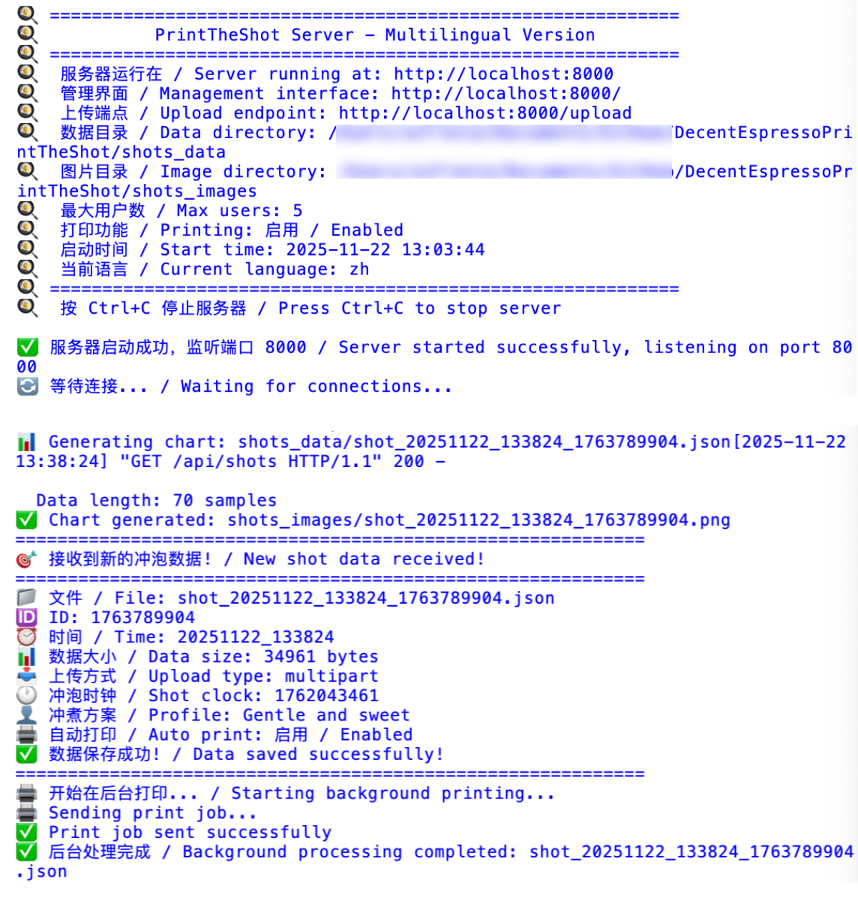
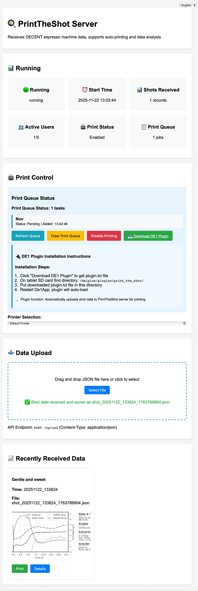
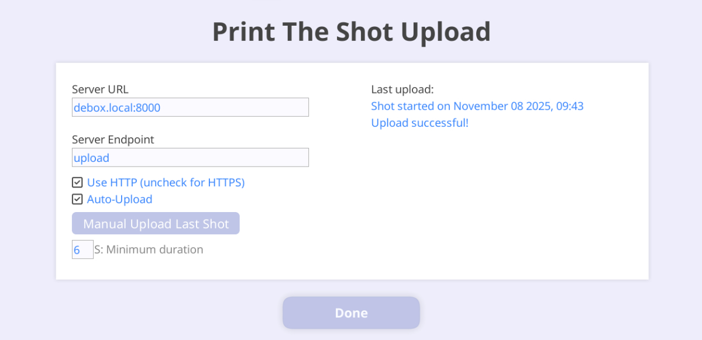
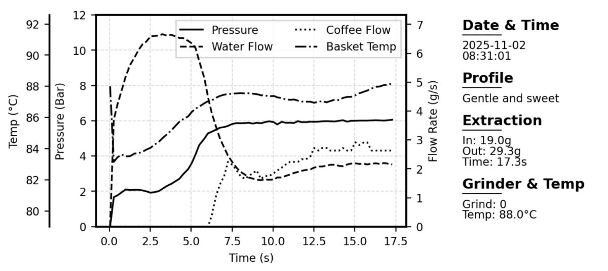
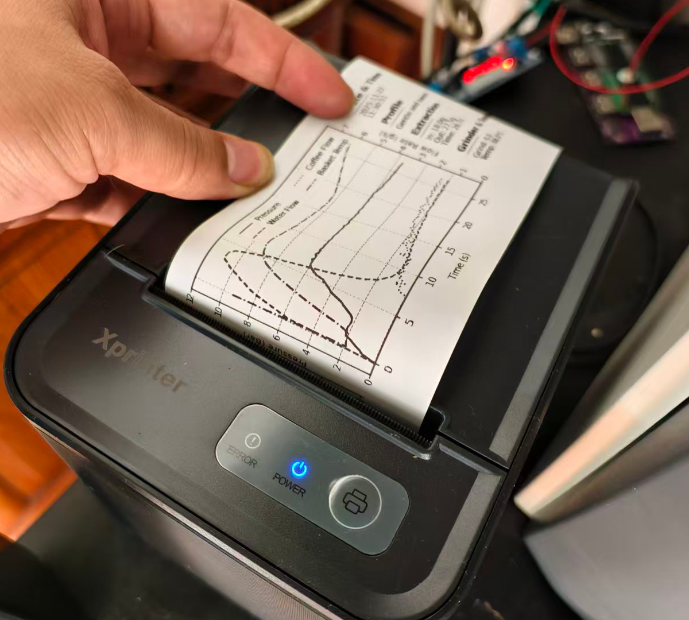

# PrintTheShot

[English Documentation](README.md) | [中文文档](README_zh.md)

完整的DECENT咖啡机冲泡数据自动上传解决方案，支持在热敏小票打印机上打印精美的冲泡分析图表。

## 功能特点

- **自动上传**: 每次萃取完成后自动上传冲泡数据
- **精美图表**: 生成专业的压力/流量/温度曲线图
- **热敏打印**: 专为80mm热敏小票打印机优化
- **网页管理**: 现代化的网页监控界面
- **多语言支持**: 支持中文和英文
- **DE1插件**: 与DECENT咖啡机无缝集成

## 截图展示

### 🖥️ 服务器运行

- **服务器启动界面** - 显示端口、数据目录和启动状态
- **实时日志** - 监控数据接收和打印任务
- **多语言支持** - 中英文服务器状态信息
- **活跃连接** - 当前用户会话和系统资源

### 🌐 网页管理

- **仪表板概览** - 服务器状态和统计信息一览
- **数据可视化** - 交互式冲泡图表，包含压力/流量/温度曲线
- **队列管理** - 实时打印队列监控和控制
- **语言切换** - 轻松在中英文界面间切换
- **手动控制** - 上传、打印和队列管理功能

### 📱 DE1集成

- **插件配置** - 服务器网址、端点和上传设置
- **手动上传** - 立即上传上次冲泡数据
- **状态显示** - 上次上传结果和时间戳
- **自动上传设置** - 最小持续时间和上传偏好

### 🖨️ 打印输出

- **专业图表** - 压力、流量速率和温度曲线
- **萃取数据** - 时间、输入/输出重量和冲泡时长
- **方案信息** - 咖啡方案名称和研磨设置
- **热敏优化** - 专为80mm小票打印机设计
- **自动切纸支持** - 兼容带切纸功能的打印机

### 🖨️ 工作中的打印机

## 硬件要求

- DECENT DE1/DE1PRO/DE1XL 咖啡机
- 树莓派（或任何Linux服务器）
- 80mm热敏小票打印机（支持大多数CUPS兼容打印机）

## 🚀 快速开始（预构建版本）

### Windows 用户

1. **下载最新版本**：从[发布页面](https://github.com/yourusername/printtheshot/releases)下载
2. **运行可执行文件**：双击 `PrintTheShot-Windows.exe`
3. **访问网页界面**：在浏览器中打开 `http://localhost:8000`
4. **配置打印机**：通过网页界面配置
5. **安装DE1插件**：从网页界面下载插件

### macOS 用户

1. **下载macOS版本**：从[发布页面](https://github.com/yourusername/printtheshot/releases)下载
2. **运行应用程序**：双击 `PrintTheShot-Mac.app`
3. **访问网页界面**：在浏览器中打开 `http://localhost:8000`
4. **配置打印机**：通过网页界面配置
5. **安装DE1插件**：从网页界面下载插件

### Linux 用户

1. **下载Linux可执行文件**：从[发布页面](https://github.com/yourusername/printtheshot/releases)下载
2. **设置为可执行**：
~~~
chmod +x PrintTheShot-Linux
~~~
3. **运行服务器**：
~~~
./PrintTheShot-Linux
~~~
4. **访问网页界面**：在浏览器中打开 `http://localhost:8000`

## 🔨 从源码构建

如果您希望从源码构建或想要贡献代码：

### 前置要求
- Python 3.8 或更高版本
- pip（Python包管理器）

### 构建步骤

1. **克隆代码库**：
~~~
git clone https://github.com/yourusername/printtheshot.git
cd printtheshot
~~~

2. **安装构建依赖**：
~~~
pip install pyinstaller
pip install -r requirements.txt
~~~

3. **运行对应平台的构建脚本**：

   **Windows**：
~~~
build-windows.bat
~~~

   **macOS**：
~~~
./build-mac.sh
~~~

   **Linux**：
~~~
./build-linux.sh
~~~

4. **在 `dist/` 目录中找到可执行文件**

## ⚙️ 手动安装（高级用户）

### 1. 服务器设置（树莓派/Linux）

#### 系统依赖

~~~
# 更新系统
sudo apt update
sudo apt upgrade -y

# 安装必要的系统包
sudo apt install -y python3 python3-pip python3-venv git cups

# 对于无图形界面系统，安装文本浏览器用于打印机配置
sudo apt install -y lynx
~~~

#### Python依赖

~~~
# 安装Python包
pip install matplotlib pillow numpy
~~~

#### 下载和运行

~~~
# 克隆代码库
git clone https://github.com/yourusername/printtheshot.git
cd printtheshot

# 设置服务器脚本为可执行
chmod +x print_the_shot_server.py

# 运行服务器
./print_the_shot_server.py
~~~

服务器将在8000端口启动。通过 `http://你的树莓派地址:8000` 访问网页界面

## 作为服务运行

### Systemd 服务（推荐用于 Linux/树莓派）

1. **创建服务文件**：
~~~
sudo nano /etc/systemd/system/printtheshot.service
~~~

2. **添加服务配置**：
~~~
[Unit]
Description=PrintTheShot Server
After=network.target

[Service]
Type=simple
User=pi
WorkingDirectory=/home/pi/PrintTheShot
ExecStart=/home/pi/PrintTheShot/print_the_shot_server.py
Restart=always
RestartSec=5

[Install]
WantedBy=multi-user.target
~~~

3. **启用并启动服务**：
~~~
sudo systemctl daemon-reload
sudo systemctl enable printtheshot.service
sudo systemctl start printtheshot.service
~~~

4. **检查服务状态**：
~~~
sudo systemctl status printtheshot.service
~~~

### 服务管理

**启动服务**：
~~~
sudo systemctl start printtheshot.service
~~~

**停止服务**：
~~~
sudo systemctl stop printtheshot.service
~~~

**重启服务**：
~~~
sudo systemctl restart printtheshot.service
~~~

**查看日志**：
~~~
sudo journalctl -u printtheshot.service -f
~~~

**禁用自动启动**：
~~~
sudo systemctl disable printtheshot.service
~~~

**完全删除服务**：
~~~
sudo systemctl stop printtheshot.service
sudo systemctl disable printtheshot.service
sudo rm /etc/systemd/system/printtheshot.service
sudo systemctl daemon-reload
~~~

### 手动后台进程

**在后台启动**：
~~~
nohup python3 print_the_shot_server.py > server.log 2>&1 &
~~~

**停止后台进程**：
~~~
pkill -f print_the_shot_server.py
~~~

### 2. 打印机配置

#### 图形界面方法（推荐桌面系统使用）

1. 打开CUPS网页界面：`http://localhost:631`
2. 添加你的热敏打印机
3. 设置纸张大小为 "Custom 80x180mm"

#### 命令行方法（适用于无头系统）

~~~
# 安装CUPS文本工具
sudo apt install -y cups-client

# 列出可用打印机
lpstat -p -d

# 如果找不到打印机，使用lynx通过文本浏览器配置
sudo lynx http://localhost:631
~~~

#### 常见热敏打印机型号

- **STAR TSP143IIU**: `driverless ipp://打印机IP`
- **Epson TM-T20II**: `sudo apt install printer-driver-escpr`
- **Zjiang ZJ-58**: 使用通用POS打印机驱动

### 3. DE1插件安装

1. **下载插件**: 从服务器网页界面点击"下载DE1插件"
2. **创建插件目录** 在DE1平板SD卡上：
   ~~~
   /de1plus/plugins/print_the_shot/
   ~~~
3. **复制插件文件**: 将 `plugin.tcl` 放入上述目录
4. **重启DE1App**: 插件将自动加载

### 4. 插件配置

1. 打开DE1App并进入 设置 → 插件
2. 找到"Print The Shot"并点击配置
3. 设置你的服务器地址：
   - **服务器网址**: `你的树莓派地址:8000` (例如：`192.168.1.100:8000`)
   - **服务器端点**: `upload`
   - **使用HTTP**: 启用（除非使用HTTPS）
4. 根据需要配置自动上传设置

## 使用方法

### 自动操作
1. 在DE1机器上制作咖啡
2. 数据自动上传到你的服务器
3. 图表自动生成并打印

### 手动操作
1. 在插件设置中使用"手动上传上次冲泡"
2. 或使用网页界面上传JSON文件

### 网页界面
访问 `http://你的服务器地址:8000` 可以：
- 查看最近的冲泡数据和图表
- 手动触发打印
- 清空打印队列
- 监控服务器状态
- 切换中英文界面

## 故障排除

### 常见问题

**DE1插件中"上传失败"**
- 检查服务器网址和网络连接
- 验证服务器是否运行：`ps aux | grep print_the_shot`
- 检查防火墙：`sudo ufw allow 8000`

**打印机不工作**
- 测试打印机：`echo "测试" | lp`
- 检查CUPS状态：`systemctl status cups`
- 验证纸张大小设置

**没有生成图表**
- 检查Python依赖：`pip list | grep -E "matplotlib|pillow|numpy"`
- 验证数据目录的写入权限

**插件没有出现在DE1中**
- 验证文件位置：`/de1plus/plugins/print_the_shot/plugin.tcl`
- 检查文件权限
- 完全重启DE1App

### 日志和调试

**服务器日志**: 查看运行服务器的终端
**DE1插件日志**: 查看DE1App插件控制台
**打印队列**: `lpstat -o`
**CUPS日志**: `sudo tail -f /var/log/cups/error_log`

## 文件结构

~~~
print_the_shot_server.py     # 主服务器脚本
plugin/plugin.tcl            # DE1插件文件
shots_data/                  # JSON冲泡数据存储
shots_images/                # 生成的图表图片
~~~

## 配置选项

### 服务器设置（网页界面）
- **打印启用**: 切换自动打印
- **最大用户数**: 并发连接限制
- **语言**: 中英文界面

### 插件设置（DE1应用）
- **自动上传**: 启用/禁用自动上传
- **最小持续时间**: 跳过短于X秒的冲泡
- **服务器配置**: 网址和端点设置

## 支持的打印机

- 80mm热敏小票打印机
- CUPS兼容打印机
- 常见型号：STAR、Epson、Zjiang、Citizen

## 贡献

欢迎提交问题报告和功能改进的拉取请求。

## 许可证

GNU通用公共许可证v3.0 - 详见LICENSE文件。

## 支持

遇到问题时：
1. 先查看上面的故障排除部分
2. 检查服务器日志中的错误信息
3. 确保所有依赖已正确安装

## 特别感谢

### 灵感与支持
衷心感谢**来自北京Siphon House的Ray**，她不仅启发了整个项目的创意，还慷慨地借出一台热敏打印机帮助项目实现。她的Siphon House也成为第一家在生产环境中使用PrintTheShot的咖啡馆。

### 技术启发
**Visualizer插件**的上传功能和UI设计，大大启发了本系统的插件功能。他们在数据处理和用户界面设计方面的优雅方案，为开发PrintTheShot的DE1插件提供了宝贵的参考。